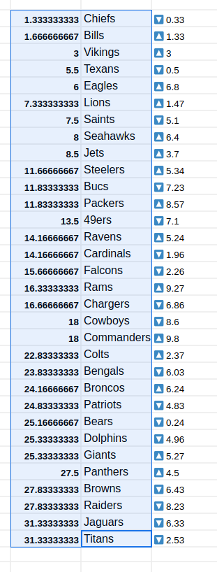

# GoodSports
### _The Most Accurate Rankings Online_

Goodsports is collaborative power ranking from the GoodSports discord.

## Public Files

[tiers/index.php](tiers/index.php) is the tier list from the combined rankings

[lists/grid.php](lists/grid.php) contains a composite grid of picks highlighting outliers. Clicking / hovering on a cell will show who gave which placement. Red outlined cells are singular outliers on the min / max ends.

[lists/stats.php](lists/stats.php) contains quick digestable stats

## Editing Rankings

Users first lock in picks on [Google Docs](https://docs.google.com/spreadsheets/d/1GPHvjQtR_RuU4ZEeuJ5vQU1fqq9grs-kSUIcLabOKkk/edit?gid=1877856051#gid=1877856051)

Individual lists get sent to [lists/lists.php](lists/lists.php)

Group combined list get saved to [tiers/tiers.txt](tiers/tiers.txt)

Entering cells is done copying from the the Google Doc (for now)

## To Do

Short:

- Allow for anyone to change combined tiers/tiers.txt from online
- Create flushed out home page. Include directions on how and where to edit lists
- Allow for more delimiters than tabs. Code only splits on "\t" as that is what comes from Google Docs

Medium:

- Create combined tier lists from all entries on lists/*.txt
    Note: This is already done with $teamRanking in lists/grid.php
- Reorganize the folder structures and file names

Long:

- Save archived weeks
- Create a timeline of archived weeks

- Find more statistics for lists/stats.php
